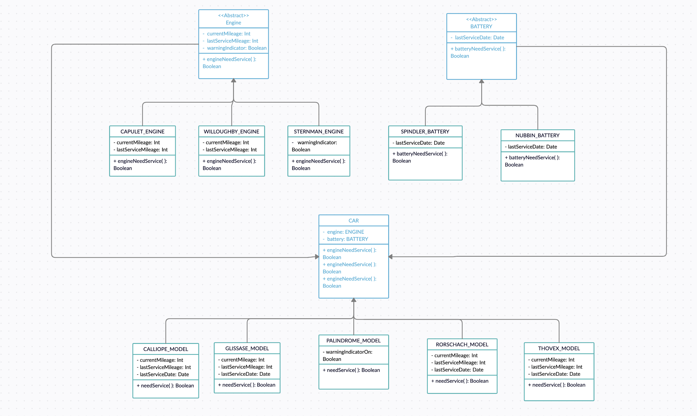

# Lyft Back-End Engineering VEP

> This repository contains the code for the Lyft Back-End Engineering VEP

### Concepts Covered

- UML Diagrams
- Software Design Patterns
- Python Scripting
- Python Modules
- Python OOPS
- Unit Testing
- Test-Driven Development (TDD)

### UML Diagram

