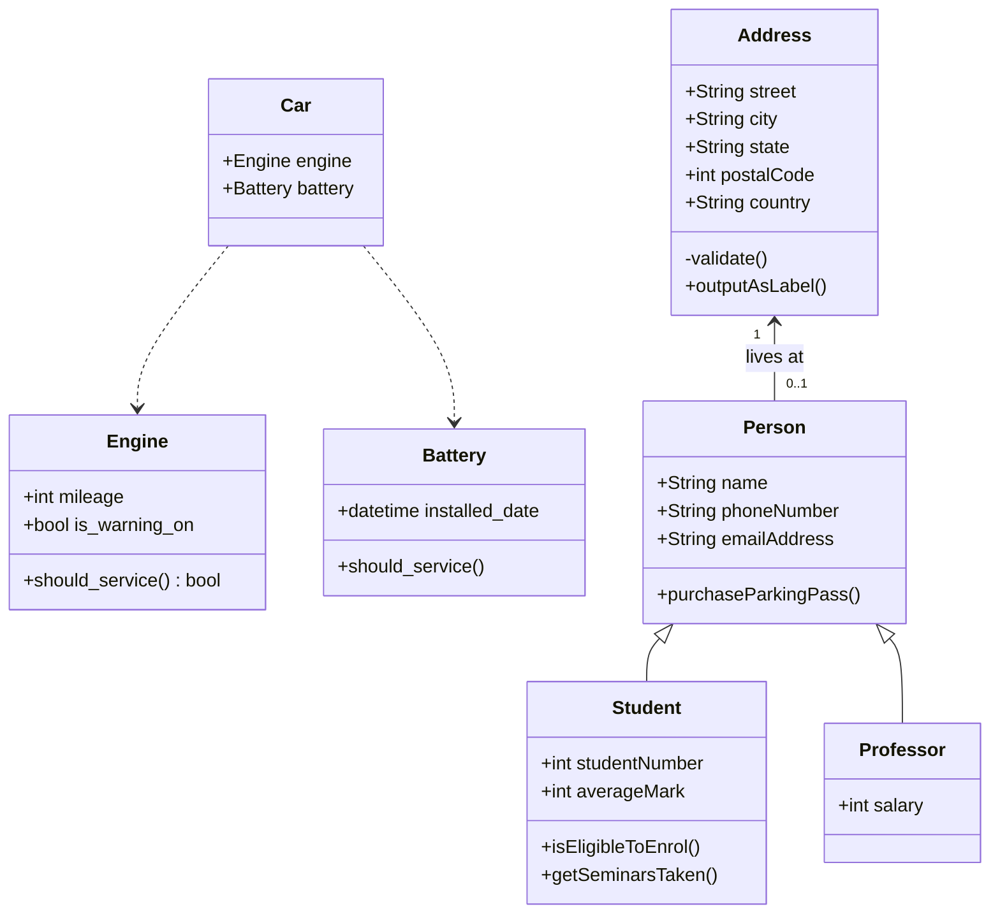

The current service criteria are as follows:

- Engines
  - Capulet Engine - should be serviced once every 30,000 miles
  - Willoughby Engine - should be serviced once every 60,000 miles
  - Sternman Engine - should be serviced only when the warning indicator is on
- Batteries
  - Spindler Battery - should be serviced once every 2 years
  - Nubbin Battery - should be serviced once every 4 years

The current car models are as follows:

- Calliope
  - Capulet Engine
  - Spindler Battery
- Glissade
  - Willoughby Engine
  - Spindler Battery
- Palindrome
  - Sternman Engine
  - Spindler Battery
- Rorschach
  - Willoughby Engine
  - Nubbin Battery
- Thovex
  - Capulet Engine
  - Nubbin Battery
