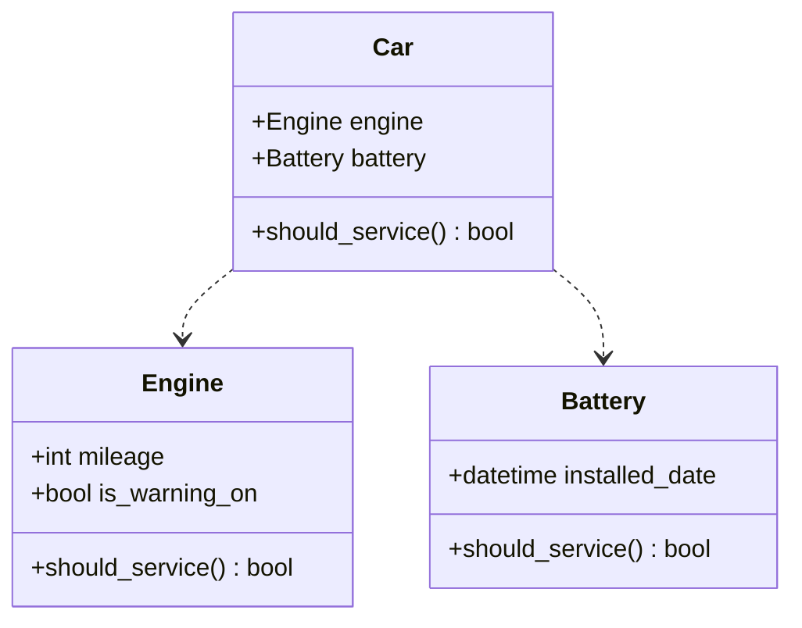

## Notes

- Engine and Battery classes are not implemented with a functioning `should_service()` function (it will raise an `NotImplementedError`).
  - Specific engines and batteries, such as Spindler or Capulet, will be classes that inherit from their related parts class and implement its own `should_service()` function
- The `should_service()` function in a Car class exists to check all parts that are in the car at once, should that function be desirable
  - In order for this function to work optimally, however, the parts should be collected in some kind of array or dict. However, there are no current plans to implement this optimally.
