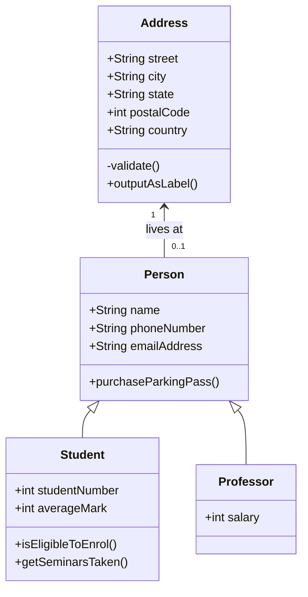

```mermaid
classDiagram
   Person <|-- Student
   Person <|-- Professor
   Person : +String name
   Person : +String phoneNumber
   Person : +String emailAddress
   Person: +purchaseParkingPass()
   Address "1" <-- "0..1" Person:lives at
   class Student{
      +int studentNumber
      +int averageMark
      +isEligibleToEnrol()
      +getSeminarsTaken()
    }
    class Professor{
      +int salary
    }
    class Address{
      +String street
      +String city
      +String state
      +int postalCode
      +String country
      -validate()
      +outputAsLabel()
    }
```
